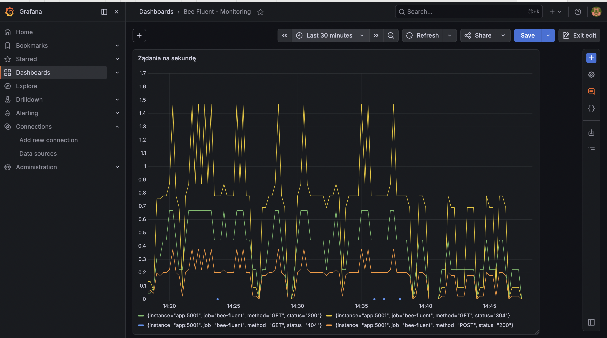
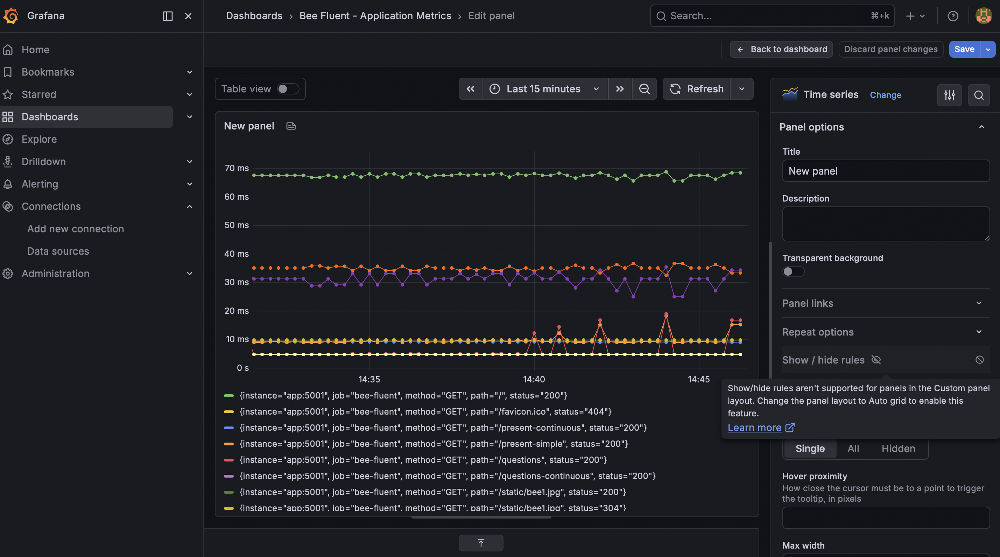

# 🐝 Bee Fluent — platforma do nauki gramatyki angielskiej


> © 2026 Maja Kempińska. Wszystkie prawa zastrzeżone.
> Kod udostępniony wyłącznie do wglądu w celach rekrutacyjnych i prezentacyjnych.

**🔗 Demo na żywo:** [bfwithmaja.azurewebsites.net](https://bfwithmaja.azurewebsites.net)

Interaktywna aplikacja webowa do nauki angielskich czasów gramatycznych — z teorią,
ćwiczeniami sprawdzanymi w czasie rzeczywistym i wyjaśnieniami po każdej odpowiedzi.
Zbudowana jako realne narzędzie edukacyjne dla [Bee Fluent with Maja](https://bfwithmaja.com),
z pełnym pipeline'em DevSecOps: od konteneryzacji, przez testy, skan bezpieczeństwa
i monitoring, po wdrożenie w chmurze zarządzane kodem.

## ✨ Funkcje aplikacji

- **Interaktywne lekcje** — Present Simple i Present Continuous
- **Trzy typy ćwiczeń** — wybór ABCD, uzupełnianie luk, układanie całych zdań
- **Sprawdzanie po stronie serwera** — poprawne odpowiedzi nie są widoczne w kodzie strony
- **Wyjaśnienia po każdej odpowiedzi** — nauka na błędach, nie tylko ocena
- **Elastyczne dopasowanie odpowiedzi** — akceptuje formy skrócone i pełne (`doesn't` / `does not`)

## 🛠️ Stack technologiczny

| Warstwa | Technologie |
|---------|-------------|
| **Backend** | Python, Flask, Gunicorn |
| **Frontend** | HTML, CSS, JavaScript (vanilla) |
| **Konteneryzacja** | Docker, Docker Compose |
| **Testy** | pytest |
| **CI/CD** | GitHub Actions |
| **Bezpieczeństwo** | Trivy (skan podatności) |
| **Chmura** | Microsoft Azure (App Service) |
| **Infrastructure as Code** | Terraform |
| **Monitoring** | Prometheus, Grafana |

## 🔄 Pipeline DevSecOps

Każdy push do gałęzi `main` uruchamia zautomatyzowany proces:

1. **Instalacja zależności** i przygotowanie środowiska
2. **Testy automatyczne (pytest)** — *bramka jakości*: jeśli test nie przejdzie, wdrożenie zostaje zablokowane
3. **Skan bezpieczeństwa (Trivy)** — obraz Dockera jest skanowany pod kątem podatności CRITICAL/HIGH; znalezione luki blokują pipeline
4. **Wdrożenie na Azure App Service** — automatyczne, bez ręcznych kroków

Bramki jakości i bezpieczeństwa zapewniają, że zepsuty lub niebezpieczny kod nie trafi na produkcję.

## 🏗️ Infrastructure as Code (Terraform)

Infrastruktura chmurowa jest opisana w kodzie (`terraform/main.tf`), nie klikana w portalu:

- **Resource Group** — grupa zasobów Azure
- **App Service Plan** — plan hostingu (Linux, warstwa F1)
- **Linux Web App** — aplikacja z runtime Python 3.11 i komendą startową Gunicorn

Cała infrastruktura powstaje jednym poleceniem `terraform apply` i znika jednym `terraform destroy` —
powtarzalnie, w wersjonowanej postaci, bez ręcznej konfiguracji.

```bash
cd terraform
terraform init
terraform plan    # podgląd zmian przed wykonaniem
terraform apply   # utworzenie infrastruktury
```

**Rozdzielenie odpowiedzialności:** Terraform zarządza infrastrukturą, a osobny pipeline CI/CD
wdraża na nią kod aplikacji — zgodnie z dobrymi praktykami DevOps.

## 📊 Monitoring (Prometheus + Grafana)

Aplikacja jest instrumentowana metrykami Prometheusa (endpoint `/metrics`).
Pełny stack monitoringu uruchamiany jest przez Docker Compose — jednym poleceniem
startują trzy usługi: aplikacja, Prometheus (zbieranie metryk) i Grafana (wizualizacja).

```bash
docker compose up
```

- **Aplikacja** — `http://localhost:5001`
- **Prometheus** — `http://localhost:9090`
- **Grafana** — `http://localhost:3000`

Dashboard w Grafanie pokazuje kluczowe metryki HTTP: liczbę żądań na sekundę
oraz czas odpowiedzi (95. percentyl) w podziale na endpointy i kody statusu.

### Żądania na sekundę


### Czas odpowiedzi (95 percentyl)


## 🚀 Uruchomienie lokalne

```bash
git clone https://github.com/MajaKempinska/bee-fluent.git
cd bee-fluent

python3 -m venv venv
source venv/bin/activate      # Windows: venv\Scripts\activate

pip install -r requirements.txt
python app.py
```

Aplikacja dostępna pod `http://localhost:5001`.

### Uruchomienie w kontenerze

```bash
docker build -t bee-fluent .
docker run -p 5001:5001 bee-fluent
```

### Uruchomienie testów

```bash
pytest -v
```

## 📁 Struktura projektu

```
bee-fluent/
├── app.py                      # Backend Flask — logika, API ćwiczeń, metryki
├── test_app.py                 # Testy automatyczne (pytest)
├── requirements.txt            # Zależności Pythona
├── Dockerfile                  # Definicja obrazu kontenera
├── docker-compose.yml          # Stack: aplikacja + Prometheus + Grafana
├── prometheus.yml              # Konfiguracja zbierania metryk
├── templates/                  # Szablony HTML
├── static/                     # Zasoby statyczne
├── docs/                       # Zrzuty ekranu (monitoring)
├── terraform/
│   └── main.tf                 # Infrastructure as Code (Azure)
└── .github/workflows/
    ├── main_bfwithmaja.yml     # CI/CD: testy + wdrożenie
    ├── trivy-security.yml      # Skan bezpieczeństwa
    └── deploy-terraform-app.yml # Wdrożenie na infrastrukturę z Terraform
```

## 🗺️ Zrealizowane etapy

- [x] Aplikacja webowa (Flask + frontend)
- [x] Konteneryzacja (Docker)
- [x] Testy automatyczne (pytest)
- [x] CI/CD z bramką jakości (GitHub Actions)
- [x] Wdrożenie w chmurze (Azure App Service)
- [x] Skan bezpieczeństwa w pipeline (Trivy)
- [x] Infrastructure as Code (Terraform)
- [x] Monitoring (Prometheus + Grafana)
- [ ] Baza danych na pytania
- [ ] Kolejne czasy gramatyczne

## 📜 Prawa autorskie

© 2026 Maja Kempińska. Wszystkie prawa zastrzeżone.

Projekt — wraz z kodem źródłowym oraz treścią edukacyjną (teoria, ćwiczenia, wyjaśnienia
gramatyczne) — jest chroniony prawem autorskim i stanowi własność autorki. Kopiowanie,
modyfikowanie, rozpowszechnianie oraz wykorzystywanie kodu lub treści — w całości lub
w części — bez wyraźnej pisemnej zgody autorki jest zabronione.

Kontakt: [bfwithmaja.com](https://bfwithmaja.com)
